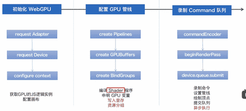

# GPU

> 检查浏览器是否支持webgpu

```js
if(navigator.gpu) console.log("支持webgpu")
```

* 需要的**开发依赖**：`@webgpu/types`、`typescript`、`vite`（更简单的构建项目）
* 生产环境依赖：`gl-matrix`


1. web页面会被分配到一个独立的渲染进程中，处于相对独立的沙盒环境，并且本身没有权利调用系统级的底层 API
2. 只能通过事先定义好的 JavaScript 与浏览器进行沟通
3. 浏览器通过 IPC（inner Process Communication）将 JavaScript 的命令传递给 `Native Modules`
4. `Native Modules` 会通过底层操作设备或者系统的 API（比如操作蓝牙/文件/ajax 请求等等）
5. 最后依然会通过 IPC 将获取的信息返回给 web



## 初始化WebGPU

> 从用户代理请求 adapter。用户代理可能返回 adapter，并且它是一个 promise

```js
const adapter = await navigator.gpu.requestAdapter({
  powerPreference: "high-performance"
  //forceFallbackAdapter: true,
})
```

* `requestAdapter()`：如果支持，返回一个`promise`。参数是一个options
  * `powerPreference?`：接受两个参数 `high-performance`，表示开启高性能的独立显卡;`low-power` 低性能的核显
    * 但是具体的控制权最终由浏览器和操作系统决定，这只是一个期望选项
  * `forceFallbackAdapter?`：一个布尔值，默认值 `false`；<span style="color:red">表示是否是否回退适配器以获得兼容，如果用户代理不支持回退适配器只能返回为</span> `null`
* adapter 有三个属性
   1. `features`：**只读**。它是该浏览器除了标准以外的扩展功能。
   2. `limits`：**只读**。gpu 支持的限制
   3. `isFallbackAdapter`：**只读**。一个布尔值，如果是 true，表示适配器已回退获得兼容

>请求 adapter 的逻辑示例,由内部对象创建.它可以被多个代理之间共享

```js
if (!adapter) throw new Error()
const device = await adapter.requestDevice({
  requiredFeatures: ["texture-compression-bc"],
  requiredLimits: {
    maxStorageBufferBindingSize: adapter.limits.maxStorageBufferBindingSize,
  },
})
```

* `requestDevice()`：如果支持，返回一个 promise。参数依然是一个 options
  * `requiredFeatures?`：数组，表示可以接受的 adapter 的扩展内容
  * `requiredLimits?`：对象。对 `device.limits` 限制的修改，可以使用的值可以参考 `adapter.limits`
* device 的属性
  * `limits`：和 `adapter.limits` 的一样，但是参数值的限制不同。可以通过 `requiredLimits` 更改
  * `features`：默认是没有任何扩展，可以使用 requiredFeatures 去为 device 增加后扩展

>配置画布

```js
const canvas = document.querySelector("canvas")

if (!canvas) throw new Error()
const context = canvas?.getContext("webgpu")

if (!context) throw new Error()

const format = navigator.gpu.getPreferredCanvasFormat()
//* 默认:bgra8unorm
context?.configure({
  device,
  format,
  compositingAlphaMode: "opaque",
})
```

* `navigator.gpu.getPreferredCanvasFormat()`：返回一个最佳的 GPUTextureFormat，用于在这个系统上显示8位深度，标准动态范围内容
  * `context?.getPreferredFormat(adapter)`：已废弃

## 配置GPU管线


* 在这里只需要配置 `Vertx Shader` 和 `Fragment Shader` 这两个 shader

>初始化管线：需要使用 device（逻辑示例）去初始化管线

* 使用异步的方法去创造一个管线 `createRenderPipelineAsync(GPURenderPipelineDescriptor)`
  * 当创建的管道准备使用时，返回的兑现的 Promise，而不会产生额外的延迟。如果管道创建失败，返回带有 OperationError 的被拒绝的 Promise
    * <span style="color:red">尽可能使用此方法，因为它可以防止在管道编译时阻塞队列时间轴工作</sapn>
* `GPURenderPipelineDescriptor`：渲染管线的初始化对象

```js
const descriptor: GPURenderPipelineDescriptor = {
  layout: "auto",
  vertex: {
    module: device.createShaderModule({
      code: vertex,
    }),
    entryPoint: "main",
  },
  primitive: {
    topology: "triangle-list",
  },
  fragment: {
    module: device.createShaderModule({
      code: frag,
    }),
    entryPoint: "main",
    targets: [
      {
        format: format,
      },
    ],
  },
}
const pipeline = await device.createRenderPipelineAsync(descriptor)
return { pipeline }
```

>设置 vertex shader：绘制点的坐标

* `device.createShaderModule(GPUShaderModuleDescriptor)`
  * `code`：这里的是使用 `WGSL` 编写的着色器的源代码
* `entryPoint`：是文件的入口。一般是 main 函数

```rust
@stage(vertex)
fn main(@builtin(vertex_index) VertexIndex : u32) -> @builtin(position) vec4<f32> {
    var pos = array<vec2<f32>, 3>(
      vec2<f32>(0.0, 0.5),
      vec2<f32>(-0.5, -0.5),
      vec2<f32>(0.5, -0.5)
    );
    return vec4<f32>(pos[VertexIndex], 0.0, 1.0);
}
```

>组合图形（primitive）

* `topology`：顶点信息的组合方式（和 `renderPass.draw()` 函数有紧密的联系）
  * `triangle-list`：每三个点形成一个三角面
  * `point-list`：将每一个点都当作一个独立的点来输出
  * `line-list`：每两个点形成一个线段，假如有三个点，只有 12 会连成线，但是 3 点不会连成线
  * `line-strip`：首尾连接的组合模式，假如有三个点，会形成 12，23 的组合模式
  * `triangle-strip`：绘制多边形可复用的边和顶点，
    * 如果使用 `triangle-list` 绘制一个四边形需要六个点，然而使用 `triangle-strip` 只需要绘制四个点（但是需要较高的顺序）

>填充颜色（Fragment Shader）

* 依然需要 `WGSL` 编写着色器的源代码
  * 除了 `vertex shader`，还需要设置渲染的颜色格式 `targets`，这里直接引用上文的 `format`

```rust
@stage(fragment)
fn main() -> @location(0) vec4<f32> {
    return vec4<f32>(1.0, 0.0, 0.0, 1.0);
}
```

## 录制command队列

> 初始化渲染通道对象

* `colorAttachments` 值的集合定义了一下内容
  * `view`： `shader` 将被展示的位置，这里就是 canvas
  * `loadOp`：绘制前对view进行的操作
    * **默认是** `clear`，清空当前 view 的内容，重新绘制
    * `load`：保留原有 view 的内容添加新的内容
  * `clearValue`：指定在执行渲染通道之前清除 `view` 的值（**背景**）。默认值 `{ r: 0, g: 0, b: 0, a: 0 }`
    * 如果 `loadOp` 的值是 clear,则忽略
  * `storeOp`：绘制后对 view 进行什么操作
    * `store`：保留绘制后 view 的内容
    * `discard`：清空绘制后 view 的内容

```ts
const view = context.getCurrentTexture().createView()
const renderPassDescriptor: GPURenderPassDescriptor = {
  colorAttachments: [
    {
      view,
      // 绘制前对view进行什么操作
      //* 默认是clear,清空当前view的内容,重新绘制
      //* load,保留原有view的内容添加新的内容
      loadOp: "clear",
      //*背景的颜色
      clearValue: { r: 0, g: 0, b: 0, a: 1 },
      // 绘制后对view进行什么操作
      //store:保留绘制后view的内容
      //discard:清空绘制后view的内容
      storeOp: "store",
    },
  ],
}
```

> 录制命令的工作

```ts
//使用encoder录制命令的工作,
const encoder = device.createCommandEncoder()
const renderPass = encoder.beginRenderPass(renderPassDescriptor)
//* 设置渲染管线
renderPass.setPipeline(pipeline)
//* 使用多少线程去运行 vertexShader,每一个线程都会生成一个固定的点坐标
//* vertexShader会被并行运行三次,然后进行光栅化处理,然后传入 fragmentShader
renderPass.draw(3)
renderPass.end()
//命令录制结束,调用finish()方法,返回一个buffer对象
const buffer = encoder.finish()
```

> 所有设置

```ts
const encoder = device.createCommandEncoder()
const view = context.getCurrentTexture().createView()
const renderPassDescriptor: GPURenderPassDescriptor = {
  colorAttachments: [
    {
      view,
      loadOp: "clear",
      clearValue: { r: 0, g: 0, b: 0, a: 1 },
      storeOp: "store",
    },
  ],
}
const renderPass = encoder.beginRenderPass(renderPassDescriptor)
renderPass.setPipeline(pipeline)
renderPass.draw(3)
renderPass.end()
const buffer = encoder.finish()
device.queue.submit([buffer])
```

## 总结

```ts
async function run() {
  const { device, format, context } = await initwebgpu()
  const { pipeline } = await initpipeline(device, format)
  draw(device, pipeline, context)
}
```

1. 初始化->创建 `Pipeline` ->录制 `commands`->提交->异步绘制
2. 请求 `adapter`，`device` 以及如何配置 `context.configure`
3. 创建管线：`createShaderModule` 以及 `createRenderPipeline`
4. 录制命令：`commandEncoder` 以及 `beginRenderPass`
5. 提交：`device.queue.submit`
