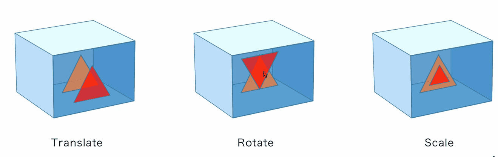

# 3D矩阵变化

## 理论

>`Normalized Device Coordinate`（NDC）：标准设备空间

* NDC 会将所有 z 轴坐标（顶点位置）直接拉伸到平面
* 即使这个图形是一个立体的 3D 图形。如果没有配合动画或者光影的效果也只是一个正方形
* 如果这个图形或者顶点超出了矩形空间，那么GPU会自动裁剪图形或者顶点信息，只保留在 NDC 中的空间的部分

* 在 `Vertex Shader Output` 实际输出的最终结果是没有这个空间限制的（可以使用超出 -1~1 的坐标），也可以任意的放大缩小整个坐标范围。GPU会自动帮助我们将内容裁剪规范到 NDC 的范围内

>图形的旋转

* `Translate`：xyz 在三个坐标上分别平移 a、b、c 的结果

$
  \begin{vmatrix}
   x+a\\
   y+b\\
   z+c\\
   1\\
  \end{vmatrix}
$
\=
$
  \begin{vmatrix}
   1&0&0&a\\
   0&1&0&b\\
   0&0&1&c\\
   0&0&0&1\\
  \end{vmatrix}
  \begin{vmatrix}
   x\\
   y\\
   z\\
   1\\
  \end{vmatrix}
$

* `Rotate`:绕x轴旋转θ角度的结果

$
  \begin{vmatrix}
   x'\\
   y'\\
   z'\\
   1\\
  \end{vmatrix}
$
\=
$
  \begin{vmatrix}
   1&0&0&0\\
   0&cosθ&-sinθ&0\\
   0&sinθ&cosθ&0\\
   0&0&0&1\\
  \end{vmatrix}
  \begin{vmatrix}
   x\\
   y\\
   z\\
   1\\
  \end{vmatrix}
$

* `Scale`：xyz 进行缩放的处理

$
  \begin{vmatrix}
   x'\\
   y'\\
   z'\\
   1\\
  \end{vmatrix}
$
\=
$
  \begin{vmatrix}
   a&0&0&0\\
   0&b&0&0\\
   0&0&c&0\\
   0&0&0&1\\
  \end{vmatrix}
  \begin{vmatrix}
   x\\
   y\\
   z\\
   1\\
  \end{vmatrix}
$

* **投影变换矩阵**：自定义更改整个空间的方向和大小，不许哟啊强行更改坐标系的范围

$
  \begin{vmatrix}
   \frac{2n}{r-l}&0&\frac{r+l}{r-l}&0\\
   0&\frac{2n}{t-b}&\frac{t+b}{t-b}&0\\
   0&0&\frac{-(f+n)}{f-n}&\frac{-2fn}{f-n}\\
   0&0&-1&0\\
  \end{vmatrix}
$

>实现 3D 变换的完整过程

* 使用独立的坐标系

* 顶点数据的处理过程(三角形转换的过程)
   1. 将 `vertex shader` 顶点数据先进行平移，旋转，缩放等模型变换，再进行投影变换，最后通过插槽传入到 `vertex shader` 中，返回结果
      * 当绘制复杂图形时，一个顶点数据被重复利用的情况，例如绘制 1000 个三角形，如果仅仅是位置不一样，使用这种方式处理就需要使用 1000 个独立的 `vertex buffer`，然后动态的切换这 1000 个顶点插槽
   2. 顶点数据一旦根据本地的坐标系建立完成，除非模型本身有变化，一般就不会再改变，可以直接将顶点插槽传入到 `vertex shader`
      * 再额外准备一个 `GPU buffer` 存储矩阵的数据，可以将需要变化的 **ModelView Matrix** 和 **Project Matrix** 独立的相乘，先计算好一个结果，形成一个统一的 `ModelViewProject` 矩阵（MVPj 矩阵）
      * 把它通过 `BindGroup` 作为全局参数传入到 `vertex shader` 中，然后可以在 `vertex shader` 中将顶点的坐标信息和MVP矩阵相乘得到最终的坐标结果
      * 这种处理的方式的好处是原始数据没有改变，可以复用一个模型的顶点数据。只要切换 BindGroup 就可以绘制不同位置的相同模型
