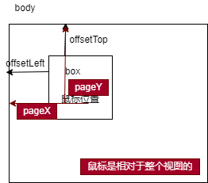

## draggable

>该属性是一个**全局属性**.是枚举类型,用于表示元素是否允许使用拖放操作

* `true`:可以拖动
* `false`:禁止拖动
* `auto`:跟随浏览器定义是否可以拖动

```html
<div draggable="true"></div>
```

## HTML拖拽API

>拖放(`Drag`和`Drop`)接口使应用能够在浏览器使用拖放功能,并且继承了[DOM event model](https://developer.mozilla.org/zh-CN/docs/Web/API/Event)以及从[mouse events](https://developer.mozilla.org/zh-CN/docs/Web/API/MouseEvent)继承而来,得到[drag events](https://developer.mozilla.org/zh-CN/docs/Web/API/DragEvent).

### DragEvent

>`DragEvent`的所有事件都是全局事件

```js
//可以直接在document上使用
document.addEventListener(
  "drag", function (event) {
    console.log(event.target)
})
```

* 在操作期间,有一些事件的类型可能会被多次触发(例如`drag`和`dragover`)

| 事件      | On型事件处理程序 | 触发时刻                                                                |
| --------- | ---------------- | ----------------------------------------------------------------------- |
| dragstart | ondragstart      | 当用户开始拖拽一个元素或选中的文本时触发                                |
| drag      | ondrag           | 当拖拽元素或选中的文本时触发或者到达可放置区域触发                      |
| dragend   | ondragend        | 当拖拽操作结束时触发(**比如松开鼠标按键或敲Esc键**)                     |
| dragexit  | ondragexit       | 当元素变得不再是拖拽操作的选中目标时触发(官网并没有详细说明)            |
| dragenter | ondragenter      | 当拖拽元素或选中的文本**刚进入**到一个可释放目标时触发                  |
| dragover  | ondragover       | 当元素或选中的文本被**拖入到一个可释放目标内时触发**(每100毫秒触发一次) |
| dragleave | ondragleave      | 当拖拽元素或选中的文本离开一个可释放目标时触发                          |
| drop      | ondrop           | 当元素放置在可放置区域时触发(此时可以取消浏览器的默认行为)              |

* 被拖动的元素事件有:`drag`,`dragstart`,`dragend`,`dragexit`
* 目的地对象事件有:`dragenter`,`dragover`,`dragleave`,`drop`

* `dragenter`和`dragover`事件的默认行为是拒绝接受任何被拖放的元素.
  * 需要使用`event.preventDefault()`阻止默认行为
* 默认触发的顺序就是:`dragstart->dragenter->dragleave->dragend`

```html
<style>
  .box {
    width: 100px;
    height: 100px;
    background-color: rgb(153, 80, 202);
  }
  .container {
    width: 400px;
    height: 400px;
    margin: 100px auto;
    border: 3px solid rgb(40, 180, 127);
  }
</style>
<body>
  <div class="box" draggable="true"></div>
  <div class="container"></div>
</body>
<script>
  const box = document.getElementsByClassName("box")[0];
  const container = document.getElementsByClassName("container")[0];
  box.addEventListener("drag", function (e) {
    //console.log(e.target, "drop")
  })
  box.addEventListener("dragstart", function (e) {
    console.log(e.target, "dragstart")
  })
  box.addEventListener("dragend", function (e) {
    console.log(e.target, "dragend")
  })
  box.addEventListener("dragexit", function (e) {
    console.log(e.target, "dragexit")
  })
  container.addEventListener("dragenter", function (e) {
    e.preventDefault()
    console.log(e.target, "dragenter")
  })
  container.addEventListener("dragover", function (e) {
    //e.preventDefault()
    //console.log(e.target, "dragover")
  })
  container.addEventListener("dragleave", function (e) {
    console.log(e.target, "dragleave")
  })
</script>
```

#### [DataTransfer](https://developer.mozilla.org/zh-CN/docs/Web/API/DataTransfer)

* `DataTransfer()`是一个构造函数,返回一个新的`DataTransfer`对象

>`DataTransfer`对象用于保存拖动并放下(drag and drop)过程中的数据.它可以报存一项或者多项的数据和每个拖拽项的类型(MIME类型)

* `DataTransfer`对象包含拖拽事件的状态(例如事件的拷贝(copy)或者移动(move)).并且可以向拖拽数据中添加或删除项目的方法

* 在`DragEvent`接口有一个[构造函数](https://developer.mozilla.org/zh-CN/docs/Web/API/DragEvent/DragEvent)和一个`dataTransfer`(dataTransfer属性就是一个DataTransfer对象)属性

>方法

1. `getData(format)`:接受指定类型的拖放.如果拖放行为没有操作任何数据,会返回一个空字符串
   * 数据类型:`text/plain`,`text/uri-list`
2. `setData()`:设置拖放操作的drag data到指定的数据和类型(一般设置MIME类型)
   * 如果给定类型的数据不存在,则将其添加到拖动数据存储的末尾,使得`types`列表中的最后一个项目将是新类型
   * 如果数据已经存在,则会替换当前位置的数据
3. `setDragImage(img, xOffset, yOffset)`:设置为自定义图像.通常在`dragstart`中使用此方法
   * 图像通常是一个\<image>元素,也可以是\<canvas>或者其他图像元素
   * `xOffset`指示相对于图片的横向偏移量;`yOffset`指向相对于图片的纵向偏移量
4. `clearData([format])`:删除给定类型的拖动操作的.如果该数据不存在,不会进行任何操作
   * `format`:如果不指定数据类型,为空字符串或者空白.则会删除所有数据类型

```js
//使用dragover阻止浏览器的默认行为.
//不能使用drapstart.drop需要拖拽元素在目标元素内才能完全触发
container.addEventListener("dragover", function (e) {
  e.preventDefault()
})
box.addEventListener("dragstart", function (e) {
  e.dataTransfer.setData("text/plain", "www.google.com")
  const img = new Image()
  img.src = "https://zyjcould.ltd/erciyuan/diana.png"
  e.dataTransfer.setDragImage(img, 0, 0)
})
container.addEventListener("drop", function (e) {
  let ele = e.dataTransfer.getData("text/plain")
  console.log(ele, "drop")
})
```

> 属性

1. `dropEffect`:用于控制在拖放过程中给用户的反馈(视觉上的),他会影响过程中光标手势.并且始终设置成effectAllowed的可能值之一
   * `copy`:操作用于指示被拖动的数据将从当前位置复制到放置位置
   * `move`:操作用于指定被拖动的数据将被移动
   * `link`:操作用于指示将在源和放置位置之间创建某种形式的关系或连接
   * `none`:项目可能禁止拖放
2. `effectAllowed`:指定拖放操作所允许的一个效果
   * `none`:此项表示不允许放下
   * `copy`:源项目的复制项可能会出现在新位置
   * `copyLink`:允许 copy 或者 link 操作
   * `copyMove`:允许 copy 或者 move 操作
   * `link`:可以在新地方建立与源的链接
   * `linkMove`:允许 link 或者 move 操作
   * `move`:一个项目可能被移动到新位置
   * `all`允许所有的操作
   * `uninitialized`效果没有设置时的默认值,则等同于all

   ```js
   box.addEventListener("dragstart", function (e) {
     e.dataTransfer.effectAllowed = "move"
   })
   container.addEventListener("dragover", function (e) {
     e.preventDefault()
     ev.dataTransfer.dropEffect = "move"
   })
   container.addEventListener("drop", function (e) {
     e.target.appendChild(box)
   })
   ```

3. `fills`:属性在拖动操作中表示**文件列表**.如果操作不包含文件,则此列表为空
   * 所有type属性(attribute)为file的\<input>元素都有一个files属性(property),用来存储用户所选择的文件

   ```html
   <input id="fileItem" type="file">
   ```

4. `types`:只读属性.返回一个我们在事件中设置的拖动数据格式(setData()).格式顺序与拖动操作中包含的数据顺序相同
5. `items`:DataTransfer的items属性只读,是拖动操作中`DataTransferItem`的`DataTransferItemList`.
   * 一个`DataTransferItemList`对象,包含了表示拖动操作中被拖动项的DataTransferItem对象,每一个拖动项对应一个列表项
   * 该列表包含了操作中每一项目的对应项,如果操作没有项目,则列表为空

##### DataTransferItem

>每个`DataTransfer`都包含一个items属性,这个属性是DataTransferItem对象的list(列表).即(DataTransferItemList)

* `DataTransferItem`描述了一个拖拽项.在一个拖拽中,每一个`drag event`都有一个dataTransfer属性,它包含存有拖拽属性的`list`,每一项都是一个DataTransferItem

>属性

1. `kind`:拖拽项的种类,`string`或者是`file`
2. `type`:拖拽想的类型.一般是MIME类型

* 由于items并不是一个数组,这里使用的是`Array.from()`转换
  * 阻止了浏览器默认直接大开图片,拖动图片或者其他类型文件.可以在控制台看到打印
  
  ```js
  container.addEventListener("drop", function (e) {
    e.preventDefault()
    Array.from(e.dataTransfer.items).forEach(item => {
      console.log(item)
    })
  })
  ```

> 方法

1. `getAsFile()`:`DataTransferItem`是一个文件,那此方法将返回拖拽项数据的File对象.否则返回null
2. `getAsString(callback)`:当`kind`属性是一个普通Unicode字符串时,该方法会用`DataTransferItem`对象的kind属性作为实参来执行传入的回调函数
   * 该回调函数有权访问`DataTransferItem`的字符串数据

```js
container.addEventListener("drop", function (e) {
  e.preventDefault()
  Array.from(e.dataTransfer.items).forEach(item => {
    if (item.kind === "file") {
      const file = item.getAsFile()
      const url = URL.createObjectURL(file)
      const img = new Image()
      img.src = url
      e.target.appendChild(img)
    }
  })
})
```

* 拖拽实现图片的上传功能

##### DataTransferItemList

>`DataTransferItemList`对象是`DataTransferItem`对象的列表.该属性可以向列表中添加拖拽项,从列表中移除拖拽项和清空列表中所有的拖拽项

* `DataTransferItemList`对象就是每个`DragEvent`属性都有的`dataTransfer`属性中的`items`属性

>属性

* `length`:李彪拖动项的数量

> 方法

1. `add()`指定数据创建新的`DataTransferItem`,并将其添加到拖动的`DataTransferItemList`中
   * `add(data, type)`.type是MIME类型.例如`text/html`或者`text/plain`
   * `add(file)`.文件对象,不需要给出任何类型
   * 如果该项目成功添加到DataTransferItemList中,则返回一个新创建的 `DataTransferItem`对象.如果关键的DataTransfer对象没有数据存储,则返回null
2. `remove(index)`:方法从列表中指定删除指定索引处的`DataTransferItem`.如果越界,则不会更改列表
3. `clear()`:将`DataTransferItemList`中的所有`DataTransferItem`删除

### 注意

1. `DataTransfer`和`DataTransferItem`接口的一个主要的不同是前者使用同步的`getData()`方法去得到拖拽项的数据,而后者使用异步的`getAsString()`方法得到拖拽项的数据
2. 使用`e.preventDefault()`这个属性可以取消一些不必要的浏览器的默认事件

## mouse

>使用`mousedown`,`mousemove`,`mouseup`配合绝对定位`absolute`来进行拖拽



1. `mousedown`:这个阶段首先确定的就是鼠标相对于盒子内部的距离`ol = pageX-offsetLeft`
   * 不光是`pageX`,也可以使用`clientX`.在合适的情况下选择合适的属性
2. `mousemove`:在执行阶段,目标是算出偏移量的距离.使用`pageX-ol`.
   * ol就是鼠标距离拖拽目标的距离(是固定的)
3. `mouseup`:在抬起阶段,解绑mousemove事事件.

```html
<style type="text/css">
  #box1 {
    position: absolute;
    width: 100px;
    height: 100px;
    background-color: red;
    cursor: pointer;
  }
</style>
<body>
  <div id="box1"></div>
</body>
<script>
  box1.addEventListener("mousedown", (e) => {
    e.preventDefault();
    bl = e.pageX - box1.offsetLeft
    br = e.pageY - box1.offsetTop
    function move(e) {
      box1.style.left = e.pageX - bl + "px"
      box1.style.top = e.pageY - br + "px"
    }
    document.addEventListener("mousemove", move, false)
    document.addEventListener("mouseup", () => {
      document.removeEventListener("mousemove", move)
    })
  })
</script>
```
