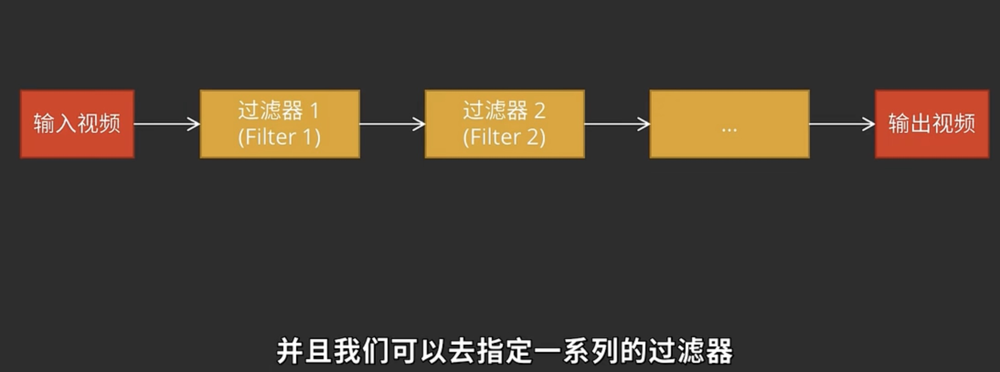

# FFmpeg 命令

## FFmpeg 的使用格式

1. ffmpeg 的命令行参数可以分成五个部分

    ```bash
    ffmpeg {1} {2} -i {3} {4} {5}
    ```

    - 1  表示全局参数
    - 2 表示文件参数
    - 3 表示输入文件
    - 4 表示输出文件参数
    - 5 表示输出文件

    ```bash
    ffmpeg \
        -y \ # 全局参数
        -c:a libfdk_aac -c:v libx264 \ # 输入文件参数
        -i input.mp4 \ # 输入文件
        -c:v libvpx-vp9 -c:a libvorbis \ # 输出文件参数
        output.webm # 输出文件
    ```

    上面的命令将 mp4 文件转成 webm 文件，这两个都是容器格式。输入的 mp4 文件的音频编码格式是 aac，视频编码格式是 H.264；输出的 webm 文件的视频编码格式是 VP9，音频格式是 Vorbis

    当然，ffmpeg 会自己判断输入文件的编码。因此上面的编码可以写成下面的样子。

    ```bash
    ffmpeg -i input.avi output.mp4
    ```

2. 使用 ffmpeg 查找信息
    - `ffmpeg --help long` 会输出高级参数
    - `ffmpeg --help full` 会输出全部帮助信息
    - `ffmpeg -h topic` 可以指定要输出的帮助类型

## 常用命令行参数

- `-c`：指定编码器
- `-c copy`：直接复制，不经过重新编码（这样比较快）
- `-c:v`：指定视频编码器，等同于 `-vcodec`，可省略
- `-c:a`：指定音频编码器，等同于 `-acodec`，可省略
- `-c:s`: 字幕编码方式，等同于 `-scodec`，可省略
- `-i`：指定输入文件
- `-an`：去除音频
- `-vn`：去除视频流
- `-sn`:删除字幕
- `-dn`:删除数据
- `-preset`：指定输出的视频质量，会影响文件的生成速度，有以下几个可用的值 ultrafast、superfast、veryfast、faster、fast、medium、slow、slower、veryslow。
- `-y`：不经过确认，输出时直接覆盖同名文件。
- **查询信息命令**
  - `-version` 显示版本
  - `-buildconf` 显示编译配置
  - `-protocols`显示可用的协议
  - `-formats`显示可用格式（muxers+demuxers）
  - `-filters` 显示可用的过滤器
  - `-muxers` 显示可用复用器
  - `-demuxers` 显示可用解复用器
  - `-codecs`显示可用编解码器（decoders+encoders）
  - `-decoders`显示可用解码器
  - `-encoders` 显示可用编码器
  - `-layouts` 显示标准声道名称
  - `-pix_fmts` 显示可用的像素格式
  - `-sample_fmts`显示可用的音频采样 格式
  - `-bsfs` 显示可用比特流filter
  - `-colors` 显示可用的颜色名称

## 常见用法

查看文件信息

1. 查看文件元信息 `ffmpeg -i input.mp4`
2. 上面命令会输出很多冗余的信息，可以使用 `ffmpeg -i input.mp4 -hide_banner`

转换编码格式

- 转换编码格式指将一种编码转成另一种编码，比如转成 `H.264` ，一般使用编码器 `libx264`，所以只需要输出文件的视频编码器即可

    ```bash
    ffmpeg -i [input.file] -c:v libx264 output.mp4
    ```

- 当然，我们也可以转成 H.265 编码

    ```bash
    ffmpeg -i [input.file] -c:v libx265 output.mp4
    ```

转换容器格式

- 转换容器格式指将视频文件从一种容器转到另一种容器。mp4→webm

    ```bash
    ffmpeg -i input.mp4 -c copy output.webm
    ```

    这里使用 `-c copy` 不经过转码，直接指定拷贝。

调整码率

- 调整码率（transrating）指的是，改变编码的比特率，一般用来将视频文件的体积变小

    ```bash
    ffmpeg \
    -i input.mp4 \
    -minrate 964K -maxrate 3856K -bufsize 2000K \
    output.mp4
    ```

    这个例子指定的码率最小为 964k，最大为 3856k，缓冲区大小为 2000k

****改变分辨率****

- 下面是改变视频分辨率的例子，将 1080p 转为 480p

    ```bash
    ffmpeg \
    -i input.mp4 \
    -vf scale=480:-1 \
    output.mp4
    ```

提取音频

- 从视频里面提取音频

    ```bash
    $ ffmpeg \
    -i input.mp4 \
    -vn -c:a copy \
    output.aac
    ```

添加音轨

- 添加音轨（muxing）指的是，将外部音频加入视频，比如添加背景音乐或旁白

    ```bash
    $ ffmpeg \
    -i input.aac -i input.mp4 \
    output.mp4
    ```

    上面的例子会将两个输入文件（音频和视频）合成一个文件

- 使用 map 方法添加音轨
  - 第一个视频的视频流和第一个音频的音频流文件合成

    ```bash
    ffmpeg -i video.mp4 -i audio.mp3  -c copy -map 0:v:0 -map 1:a:0 out.mp4
    ```

截图

- 下面的例子是从指定时间开始，连续对1秒钟的视频进行截图

    ```bash
    $ ffmpeg \
    -y \
    -i input.mp4 \
    -ss 00:01:24 -t 00:00:01 \
    output_%3d.jpg
    ```

- 也可以指定只截取一张图

    ```bash
    $ ffmpeg \
    -ss 01:23:45 \
    -i input \
    -vframes 1 -q:v 2 \
    output.jpg
    ```

  `-vframes 1` 指定只截取一帧，`-q:v 2` 表示输出的图片质量，一般是 1-5之间（1表示最高质量）

裁剪视频

- 裁剪指的是，截取原视频的一个片段，输出成为一个新视频，可以指定开始时间（start）和持续时间（duration），也可以指定结束时间（end）…

    ```bash
    ffmpeg -i [input] -ss [start] -t [duration] -c copy [output]
    ffmpeg -i [input] -ss [start] -to [end] -c copy [output]
    ```

- 不同的裁剪方式

    ```bash
    ffmpeg -i input.mp4 -ss 00:01:00 -to 00:01:10 -c copy out.mp4
    # 下面两个 -ss 在 -i 的前面，使用了关键帧技术，开头和结束的视频可能对不上
    ffmpeg -ss 00:01:00 -i input.mp4 -to 00:01:10 -c copy out.mp4
    # 所以需要增加 copyts 保留时间戳
    ffmpeg -ss 00:01:00 -i input.mp4 -to 00:01:10 -c copy copyts out.mp4
    ```

为音频添加封面

- 下面命令中，有两个输入文件，一个是封面图片`cover.jpg`，另一个是音频文件`input.mp3`。`-loop 1`参数表示图片无限循环，`-shortest`参数表示音频文件结束，输出视频就结束。

    ```bash
    ffmpeg \
    -loop 1 \
    -i cover.jpg -i input.mp3 \
    -c:v libx264 -c:a aac -b:a 192k -shortest \
    output.mp4
    ```

创建缩略图

- 下面的命令可以在当前目录下穿件创建若干张缩略图。

    ```bash
    ffmpeg -i test.mp4 -vf "fps=1/10,scale=-2:720" thumbnail-%03d.jpg
    ```

    `fps`  代表的是**帧率. `1/10` 表示每 10s 输出一帧画面**

    thumbnail-%03d，表示 `thumbnail` 开头的以 001增序的缩略图

添加水印

- 首先需要准备一张图片 `dog.jpg`. overlay 过滤器用于将水印叠加在原始视频的上面，后面的两个参数指定了水印在图像中的位置，例如 100:100 就是在与左上角有一定距离的位置

    ```bash
    ffmpeg -i test.mp4 -i dog.jpg -filter_complex "overlay=100:100" out.mp4
    ```

gif 动图

- 由于 gif 不适合较大视频的转换，所以开始先要剪切并且压缩视频
  - `split[a][b];[a]palettegen[p];[b][p]paletteuse` 这一部分是由于 gif 256色的限制

    ```bash
    ffmpeg -i test.avi -ss 0 -t 3 \
     -filter_complex "[0:v]fps=15,scale=-1:256,split[a][b];[a]palettegen[p];[b][p]paletteuse" \
     out.gif
    ```

录屏

- 录制屏幕
  - 一些命令讲解
    - **desktop**：desktop是指输入设备是桌面屏幕
    - **framerate**：帧率
    - **draw_mouse**：是否绘制鼠标，0：不绘制鼠标，1：绘制鼠标（如果为空默认为1）
    - **offset_x**：捕获的区域X坐标，屏幕左上角为起始坐标 `(0,0)`，右下角为`(screenSize,screenSize)`
    - **offset_y**：捕获的区域Y坐标
  - 查找所有可用的设备

    ```bash
    ffmpeg -f avfoundation -list_devices true -i ""
    ```

  - windows， `gdigrab` win 自带的录制工具

    ```bash
    ffmpeg -hide_banner -loglevel error -stats -f gdigrab -framerate 60 \
    -offset_x 0 -offset_y 0 -video_size 1920x1080 -draw_mouse 1 -i deskop \
    -c:v libx264 -r 60 -preset ultrafast -pix_fmt yuv420p -y screen_record.mp4
    ```

  - Mac 下录制屏幕
    - avfoundation -i 1:0
    - 这里的 1是视频输入位置（可能也有其他设备，如显示器）， 0代表音频输入位置

    ```bash
    ffmpeg -f avfoundation -i 1:0 -vcodec libx264 -preset ultrafast -acodec libmp3lame -f flv out.flv
    ```

    - 也可以不指定编码器，指定视频的帧率以及视频的大小

    ```bash
    ffmpeg -f avfoundation -r 30 -s 1280x720 -i "1:1"  output.mkv
    ```

    - 指定视频需要录制的时间也是可以的 `-t`

    ```bash
    ffmpeg -f avfoundation -t 5  -i 2:0 out.mkv
    ```

## ffmpeg 命令进阶

### 理解预设（-preset）

- 预设参数
  - ultrafast
  - superfast
  - veryfast
  - faster
  - fast
  - medium
  - slow
  - slower
  - veryslow

```bash
ffmpeg -i test.avi -c:v libx264 -preset xxx out.mp4
```

- `veryfast` 拥有最快的速度，但是会产生较大的文件
- `veryslow` 拥有最慢的速度，但是会产生较小的文件
- `medium` 默认值

### 关于质量

- `-crf number`：**Constant Rate Factor，恒定速率因子模式**（number 参数的值在 0 **无损** - 55 **最差质量**），质量越差文件越小
  - 在优先保证画面质量（也不太在乎转码时间）的情况下，使用-crf参数来控制转码是比较适宜的
  - 从主观上讲，18——28是一个合理的范围。18被认为是视觉无损的（从技术角度上看当然还是有损的），它的输出视频质量和输入视频相当

    ```bash
    ffmpeg -i test.avi -c:v libx264 -crf 22 out.mp4
    ```

- `-preset` 预设的编码质量。**为什么 `veryslow` 之下没有任何参数**
  - **这是一种收益递减准则：**slow 与medium相比提升了5%——10%；slower 与 slow相比提升了5%；veryslow 与slower相比提升了3%。与veryslow相比，如果继续设定一个以极高的编码时间为代价的参数，只换取了大概1%的视频质量提升。
- `-profile:v` 指定编码器的配置，和压缩比有关
  - `basline`：实时通信领域
  - `main`：流媒体视频
  - `high`：高清视频
- `-level:v`:对编码器具体规范配置的规范和限制，**由于压缩比和画质成反比**
  - 参数：**1.1,1.2 2.1,2.2 …. 5.1,5.2**
  - 如果是 1080p 的视频就使用 4.1

### 过滤器（filter）

[FFmpeg Filters Documentation](https://ffmpeg.org/ffmpeg-filters.html)



前一个过滤器的输出会直接作为下一个过滤器的输入

- 通常多媒体 filter 的分类
  - 音频filter
  - 视频filter
  - 字幕filter
- ffmpeg 中 filter 的分类
  - source filter （只有输出）
  - audio filter
  - video filter
  - Multimedia filter
  - sink filter （只有输入）
- **-vf 使用（视频）**
  - 如果一个 fliter 有多个参数，需要使用 `,` 分隔

     ```bash
     ffmpeg -i test.avi -c:v libx264 -vf "scale=1024:-1" output.mp4
     ```

  - 其中 `scale` 指的是缩放**长宽比，-1→指根据另一个参数帮我们推断**
  - 如果想转换成 **720p，可以写成 `scale=-1:720`**
  - 如果是多个 filter，可以使用 `,` 隔空

     ```bash
     ffmpeg -i test.avi -c:v libx264 -vf "scale=1024:-1,transpose=1,crop=iw/3:ih/3" output.mp4
     ```

  - 给视频添加水印

     ```bash
     ffmpeg -i in.mp4 -i logo.png -filter_complex "overlay=20:20" out.mp4
     ```

  - 给视频添加封面

     ```bash
     ffmpeg -i [DIR_OF_INTPUT_VIDEO] -i [DIR_OF_INPUT_IMAGE] \
     -map 0 -map 1 \
     -c copy -c:v:1 png \
     -disposition:v:1 attached_pic \
     [DIR_OF_OUTPUT_VIDEO]
     ```

  - ****视频缩放****

     ```bash
     # 宽度和高度
     ffmpeg -i input.mp4 -vf "scale=w=800:h=600" output.mp4
     # in_w\in_h 输入尺寸
     ffmpeg -i input.mkv -vf "scale=w=1/2*in_w:h=1/2*in_h" output.mkv
     ```

  - 视频裁剪（默认以视频的中心点为视频的原点）

     ```bash
     # 从左上角开始
     ffmpeg -i input.mp4 -vf "crop=w=1280:h=720:x=0:y=0" output.mp4 
     # 从视频中心点开始
     ffmpeg -i input.mkv -vf "crop=w=400:h=400" output.mkv
     # 剪到视频的 3/4
     ffmpeg -i input.mkv -vf "crop=w=3/4*in_w:h=3/4*in_h" output.mkv
     ```

  - 视频旋转，指定一个弧度，顺时针旋转视频，你可以给角度然后乘以 **PI/180**

     ```bash
     # 顺时针旋转 90
     ffmpeg -i input.avi -vf "rotate=90*PI/180" 
     # 顺时针旋转 180，翻转 90
     ffmpeg -i input.mp4 -vf "rotate=PI"
     ```

  - **setpts** (PTS = presentation time stamp) 更改视频播放速度，较大的数值意味着较慢的播放速度

     ```bash
     # 加速
     ffmpeg -i input.mkv -vf "setpts=0.5*PTS" output.mkv 
     # 减速
     ffmpeg -i input.mp4 -vf "setpts=2*PTS" output.mp4
     ```

  - 添加背景音乐
    - ffmpeg -i 原始视频文件 -i 背景音乐文件 -filter_complex \[1:a]aloop=loop=-1:size=2e+09[out];\[out]\[0:a]amix -t 视频时间 添加背景音乐后的视频文件
      - -filter_complex：滤镜
      - [1:a]aloop=loop=-1:size=2e+09[out]; 将背景音无限循环
      - \[out]\[0:a]amix 将背景音和视频中的音频混合
      - -t 10 文件时长，单位为秒，建议取值原始视频总时长

        ```bash
        ffmpeg -i 1.mp4 -i test.mp3 -filter_complex [1:a]aloop=loop=-1:size=2e+09[out];[out][0:a]amix -t 10 out.mp4
        ```

    - ffmpeg -i 原始视频文件 -stream_loop -1 -i 背景音乐文件 -filter_complex \[0:a]\[1:a]amix -t 时长 添加背景音乐后的视频文件
      - -stream_loop -1 参数 -1 代表循环输入源（背景音乐）
      - \[0:a]\[1:a]amix 将0和1号的音频流进行混合
      - -t 10 文件时长，单位为秒，建议取值原始视频总时长

        ```bash
        ffmpeg -i video.mp4 -stream_loop -1 -i test.mp3 -filter_complex [0:a][1:a]amix -t 10 out4.mp4
        ```

- -af 使用（音频）
    1. 使用 `volumn` 可以用来调节音量的大小

        ```bash
        ffmpeg -i test.mp4 -af "volumn=1.5" out.mp4
        ```

    2. 使用 `loudnorm` 可以用来统一视频的音量

        ```bash
        ffmpeg -i test.mp4 -af "loudnorm=I=-5:LRA=1" out.mp4
        ```

    3. 添加高通、低通滤波器、均衡器等

        ```bash
        ffmpeg -i test.mp4 -af "equalizer=f=1000:width_type=h:width=200:g=-10" out.mp4
        ```

    4. 删除音频、视频、字幕、数据流

        ```bash
        ffmpeg  -i test.mp4 -an/-vn/-sn/-dn out.mp4
        ```

    5. 让声音同时在左右声道出现(有时候音频只能右耳听到)

        ```bash
        ffmpeg -i input.mp3 -af "channelmap=1-0|1-1" output.mp3
        ```

    6. **atempo** 它只接受 **0.5**(半速) 到 **2** (倍速)之间的值。为了越过这个限制，你可以链式使用这个过滤器

        ```bash
        ffmpeg -i input.wav -af "atempo=0.75" output.wav 
        # 加速 4 倍
        ffmpeg -i input.mp3 -af "atempo=2.0,atempo=2.0" ouutput.mp3
        ```

### filter

- **音频filter**
  - `adelay` filter实现不同声道的延时处理。使用参数如下`adelay=1500|0|500`，这个例子中实现第一个声道的延迟1.5s，第三个声道延迟0.5s，第二个声道不做调整。
  - `aecho` filter实现回声效果，具体参考 [http://ffmpeg.org/ffmpeg-filters.html#aecho](http://ffmpeg.org/ffmpeg-filters.html#aecho) 。
  - `amerge` filter将多个音频流合并成一个多声道音频流。具体参考 [http://ffmpeg.org/ffmpeg-filters.html#amerge-1](http://ffmpeg.org/ffmpeg-filters.html#amerge-1) 。
  - `ashowinfo` filter显示每一个audio frame的信息，比如时间戳、位置、采样格式、采样率、采样点数等。具体参考 [http://ffmpeg.org/ffmpeg-filters.html#ashowinfo](http://ffmpeg.org/ffmpeg-filters.html#ashowinfo) 。
  - `pan`filter特定声道处理，比如立体声变为单声道，或者通过特定参数修改声道或交换声道。主要有两大类：混音处理，比如下面的例子`pan=1c|c0=0.9*c0+0.1*c1`，实现立体声到单声道的变换；声道变换，比如5.1声道顺序调整，`pan="5.1| c0=c1 | c1=c0 | c2=c2 | c3=c3 | c4=c4 | c5=c5"`。
  - `silencedetect`和`silenceremove` filter根据特定参数检测静音和移除静音。
  - `volume`和`volumedetect` filter这两个filter分别实现音量调整和音量检测。
  - audio source filter`aevalsrc` filter按照特定表达式生成音频信号。`anullsrc` filter生成特定的原始音频数据，用于模板或测试。`anoisesrc` filter生成噪声音频信号。`sine` filter生成正弦波音频信号。
  - audio sink filter`abuffersink` filter和`anullsink` filter，这些filter只是用于特定情况下结束filter chain。
- **视频filter**
  - `blend`和`tblend` filter将两帧视频合并为一帧。具体参数参考 [http://ffmpeg.org/ffmpeg-filters.html#blend](http://ffmpeg.org/ffmpeg-filters.html#blend) 。
  - `crop` filter按照特定分辨率裁剪输入视频，具体参数参考 [http://ffmpeg.org/ffmpeg-filters.html#crop](http://ffmpeg.org/ffmpeg-filters.html#crop) 。
  - `drawbox`、`drawgrid`、`drawtext` filter绘制box（对话框）、grid（表格）、text（文本）。
  - `edgedetect` filter边缘检测filter。
  - `fps` filter按照指定帧率输出视频帧（丢帧或者复制）。具体参考 [http://ffmpeg.org/ffmpeg-filters.html#fps-1](http://ffmpeg.org/ffmpeg-filters.html#fps-1) 。
  - `hflip`、`vflip` filter水平和垂直镜像。
  - `histogram` filter生成每帧的各颜色分量的直方图。
  - `noise` filter在输入视频帧中添加白噪声。
  - `overlay` filter视频叠加。具体参考 [http://ffmpeg.org/ffmpeg-filters.html#overlay-1](http://ffmpeg.org/ffmpeg-filters.html#overlay-1) 。
  - `pad` filter视频边界填充。具体参考 [http://ffmpeg.org/ffmpeg-filters.html#pad-1](http://ffmpeg.org/ffmpeg-filters.html#pad-1) 。
  - `rotate` filter视频任意角度旋转。具体参考 [http://ffmpeg.org/ffmpeg-filters.html#rotate](http://ffmpeg.org/ffmpeg-filters.html#rotate) 。
  - `scale` filter使用libswscale库完成视频缩放的filter。
  - `showinfo` filter显示视频帧的参数信息，比如时间戳、采样格式、帧类型等。
  - `subtitles` filter使用libass库绘制subtitle（字幕）。
  - `thumbnail` filter提取缩略图的filter。
  - `transpose` filter图像转置的filter。参数参考 [http://ffmpeg.org/ffmpeg-filters.html#transpose](http://ffmpeg.org/ffmpeg-filters.html#transpose) 。
- **source filter**

    主要有`buffer`、`cellatuo`、`coreimagesrc`、`mptestsrc`、`life`等filter，具体效果建议参考ffmpeg用户手册。

- **source sink**

    主要有`buffersink`、`nullsink`两个filter。

- **多媒体filter**
  - `ahistogram` filter将音频转化为视频输出，并显示为音量的直方图。
  - `concat` filter将音频流、视频流拼接成一个。具体参考 [http://ffmpeg.org/ffmpeg-filters.html#concat](http://ffmpeg.org/ffmpeg-filters.html#concat) 。
  - `metadata`、`ametadata` filter操作metadata信息。
  - `setpts`、`asetpts` filter改变输入音频帧或视频帧的pts。
  - `showfreqs`、`showspectrum`、`showspertrumpic`、`showvolume`、`showwaves` filter将输入音频转换为视频显示，并显示频谱、音量等信息
  - `split`、`asplit` filter将输入切分为多个相同的输出。
  - source filter主要是`movie`、`amovie` filter。从movie容器中读取音频或者视频帧。

## 剪切与合并

- 使用 `-ss` 一定要在 `-i` 参数后面，因为使用的是关键帧定位，所以起始的位置可能有偏差

裁剪视频

- 裁剪指的是，截取原视频的一个片段，输出成为一个新视频，可以指定开始时间（start）和持续时间（duration），也可以指定结束时间（end）…

    ```bash
    ffmpeg -i [input] -ss [start] -t [duration] -c copy [output]
    ffmpeg -i [input] -ss [start] -to [end] -c copy [output]
    ```

- 不同的裁剪方式

    ```bash
    ffmpeg -i input.mp4 -ss 00:01:00 -to 00:01:10 -c copy out.mp4
    # 下面两个 -ss 在 -i 的前面，使用了关键帧技术，开头和结束的视频可能对不上
    ffmpeg -ss 00:01:00 -i input.mp4 -to 00:01:10 -c copy out.mp4
    # 所以需要增加 copyts 保留时间戳
    ffmpeg -ss 00:01:00 -i input.mp4 -to 00:01:10 -c copy copyts out.mp4
    ```

- **合并视频**
  - 需要将要合并的视频以以下格式写入 `input.txt` 文档中

     ```txt
     file 'file1.mp4'
     file 'file2.mp4'
     file 'file3.mp4'
     ```

    - 使用 `-f concat` 表示接下来传入的是一个视频列表

       ```txt
       ffmpeg -f concat -i input.txt -c copy output.mp4
       ```

## -map 命令

```bash
-map input_file_index:stream_type_specifier:stream_index
```

1. `input_file_index`: 输入的文件索引（从 0 开始）
2. `stream_type_specifier`: 指定文件的流的类型（a：表示音频，v：表示视频）
3. `stream_index`：指定流的类型的索引（从 0 开始）

- 例如 `map 0:a:1`（从0开始计数）从视频中选择第二个音轨

> 同样，`-map 0`是指选择第一个输入文件中的所有数据（包括音频和视频）；如果你只要选择视频流，使用 `-map 0:v`，或者音频流（`-map 0:a`）； 如果只要一个音频，选择 `-map 0:a:1` 第二个音频，那么就是过滤音频

```bash
ffmpeg -i input.mp4 -map 0 -map 0:a:1 -c copy out.mp4
```

- **反向的map命令**（在map命令的参数前加负号）。使用 `-map -0:a:0` 这一命令，FFmpeg在选择时就会忽略第一个音轨，例如该视频有五个音频，只想保留除第一个的其他四个

```bash
ffmpeg -i input.mp4 -map 0 -map -0:a out.mp4
```

## 与图片相关

- 多张图片转为视频
  - 示例说明：将当前目录001.jpg到999.jpg的图片，以每秒3张图片的速度合成视频文件out.mp4
    - `%d`:表示占位符，其中 %3d 表示3个占位符，如 001 ～ 999
    - `-r`：表示帧率，这里指每 1s 切换 3 张图片，默认是 25（如果没有指定的话）
      - 输入帧率：在 -i 之前是输入的帧率。输出帧率：在 -i 之后，默认和输出帧率一样
      - 注意：-r 一般放在 -i 之前就好。如果输入帧率是 -r 0.5 即，一张图片播放两秒，如果输出帧率是 -r 30，那么这两秒就会是 60帧 放这张图

    ```bash
    ffmpeg -r 3 -i %3d.jpg out.mp4
    ```

- 多张图片转为视频并添加背景音乐
  - 将当前目录001.jpg到999.jpg的图片，以每秒3张图片的速度合成视频文件out.mp4，同时添加音频
  - 如果音频文件的长度大于视频的文件，则合成后的视频会停留在最后一个画面播放音频

    ```bash
    ffmpeg -r 3 -i %3d.jpg -i test.mp3 -shortest out2.mp4
    ```

- 从视频中提取图片
  - ffmpeg -i 原始视频文件 -ss 开始时间 -t 时间长度 -s  宽度*高度 -r 每秒图片张数 输出图片
  - 获取640*624分辨率的图片，每秒获取3张图片
  - 图片的分辨率最好和视频的分辨率一致，可以用 ffproble -i 1.mp4 的方式获取视频的分辨率信息

    ```bash
    ffmpeg -i 1.mp4 -ss 00:00:05 -t 5 -s 640*624 -r 3 %3d.jpg
    ```

- 图片转场特效

    [Xfade - FFmpeg](https://trac.ffmpeg.org/wiki/Xfade)

  - ffmpeg -loop 1 -t 时长 -i 图片文件名 -loop 1 -t 时长 -i 图片文件名 -filter_complex "xfade=transition=特效名:duration=特效时长:offset=视频做转场的起始位置，format=yuv420p" 编辑后的视频文件
    - 要求图片 1.jpg 和 2.jpg 的分辨率一致
    - duration=1:offset=2 表示转场效果从第 2s 开始持续 1s
    - transition=rectcrop 是转场效果，rectcrop 可以修改为其他转场效果

    ```bash
    ffmpeg -loop 1 -t 3 -i 1.jpg -loop 1 -t 3 -i 2.jpg -filter_complex "xfade=transition=rectcrop:duration=1:offset=2,format=yuv420p" out.mp4
    ```
