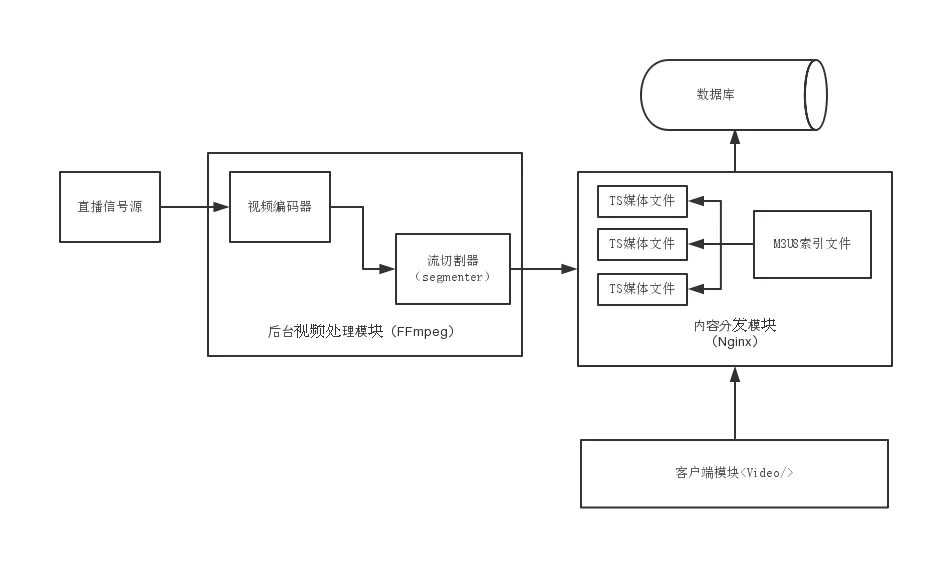

# m3u8

> m3u8 文件是 UTF-8 编码格式的 m3u 文件。m3u 文件是记录了一个索引纯文本文件，打开它时播放软件并不是播放它，而是根据它的索引找到对应的音视频文件的网络地址进行在线播放。



## m3u8 文件格式

> m3u8 的 MIME 类型是 `application/vnd.apple.mpegurl`，扩展名是 `.m3u8`。

* #EXTM3U：文件头，表明这是一个 M3U 文件。
* #EXT-X-VERSION：定义播放列表的版本号。
  * 用法：#EXT-X-VERSION:3
* #EXT-X-TARGETDURATION：定义每个媒体段的最大持续时间（秒）。
  * 用法：#EXT-X-TARGETDURATION:10
* #EXT-X-MEDIA-SEQUENCE：定义媒体段序列号。
  * 用法：#EXT-X-MEDIA-SEQUENCE:5
* #EXTINF：定义下一个媒体段的持续时间（秒）。
  * 用法：#EXTINF:9.009,
* #EXT-X-KEY：定义解密密钥的方法和位置。
  * 用法：#EXT-X-KEY:METHOD=AES-128,URI="<https://example.com/key>"
* #EXT-X-STREAM-INF：定义一组备用流，并包括流属性，如带宽和分辨率。
  * 用法：#EXT-X-STREAM-INF:BANDWIDTH=1280000,RESOLUTION=720x480
* #EXT-X-DISCONTINUITY：表示接下来的媒体段与前一个有不连续性。
* #EXT-X-ENDLIST：表示播放列表文件的结束。
* #EXT-X-MEDIA：用于描述媒体流属性，如音轨或字幕。
  * 用法：#EXT-X-MEDIA:TYPE=AUDIO,GROUP-ID="audio",LANGUAGE="en",NAME="English",DEFAULT=YES,AUTOSELECT=YES,URI="audio.m3u8"

## 使用 `ffmpeg` 下载合成 m3u8 文件

```bash
ffmpeg -i https://m3u.if101.tv/xm3u8/65f1037a4b9a7973ba40d271740d0cebbd51caf3c5645478a7597f0890da43269921f11e97d0da21.m3u8 -c copy season3_08.mp4
```

* 参考：<https://www.cnblogs.com/tianma3798/p/16339882.html>
* 参考：<https://zhuanlan.zhihu.com/p/184577862>
* 参考：<https://datatracker.ietf.org/doc/html/draft-pantos-http-live-streaming-23>
