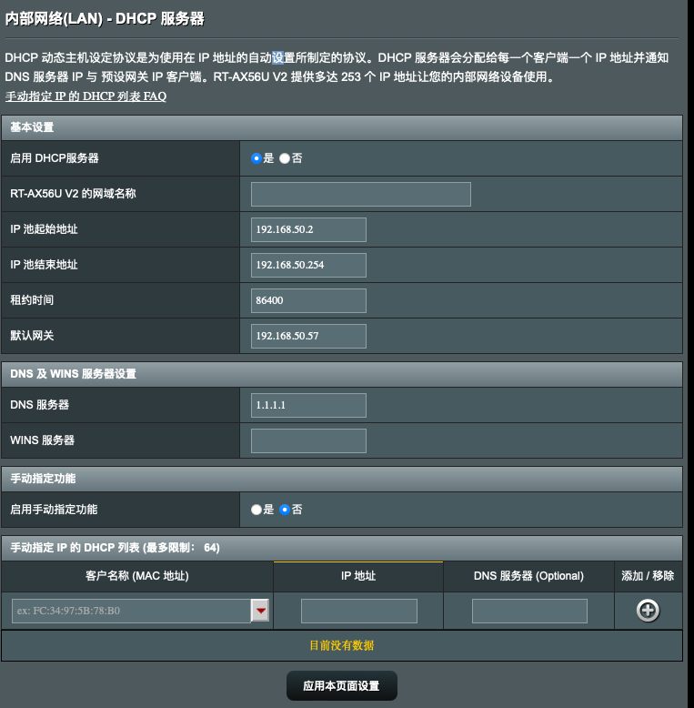

# IPv6

>主路由进行 PPPoE 桥接之后，由主路由开启 IPv6，这样每个设备默认会分配到一个公网 IP 地址。


开启 IPv6 代理后，会出现一系列的兼容问题，建议不要开启。IPv6 建议用于国内直连。

注意：需要跟据 Vps/节点提供商确认是否支持，如果该站点支持 IPv6 可以放心大胆地开启，并根据以下操作食用。

该站点只支持 ipv6：<http://6.ipw.cn>

## IPv6 的 nat

> 当 IPv6 的网关还是使用 nat 分发 IPv6 的内网地址时，并且在只有链路本地地址（`fe80` 开头）时，无法访问 IPv6 地址。

在使用 dig 查询某网站的 aaaa 记录时，可能出现 IPv4 到 IPv6 地址的映射。例如 `::ffff:198.18.0.72`:

```txt
$dig aaaa 6.ipw.cn
; <<>> DiG 9.10.6 <<>> aaaa 6.ipw.cn
;; global options: +cmd
;; Got answer:
;; ->>HEADER<<- opcode: QUERY, status: NOERROR, id: 20501
;; flags: qr rd ra; QUERY: 1, ANSWER: 1, AUTHORITY: 0, ADDITIONAL: 0

;; QUESTION SECTION:
;6.ipw.cn.    IN  AAAA

;; ANSWER SECTION:
6.ipw.cn.   1 IN  AAAA  ::ffff:198.18.0.72

;; Query time: 0 msec
;; SERVER: 198.18.0.2#53(198.18.0.2)
;; WHEN: Thu Feb 23 18:15:49 CST 2023
;; MSG SIZE  rcvd: 54
```

当 IPv6 启用的设备向 IPv4 地址发送数据包时，IPv6 栈通过在前面加上 `::ffff:` 的前缀，将 IPv4 地址映射为 IPv6 地址。这允许数据包通过 IPv6 网络发送到 IPv4 设备。

代理端如果有 IPv6 地址，会替我们访问该仅有 IPv6 地址的网站，并将该网站地址转换为兼容 IPv4 的 IPv6 地址。这样不支持 IPv6 的设备就可以访问了。</sapn>

> 当你使用 fake-ip 的时候（例如，Shadowrocket、Clash 等），代理服务器会替你访问 IPv6 的地址，同时帮你转换到兼容 IPv4 的 IPv6 地址。

### [IPv6 子网划分](https://zhuanlan.zhihu.com/p/556136525)

> IPv6 WAN/LAN 分配：<https://zhuanlan.zhihu.com/p/362151770>
>
> OpenWrt 设置 IPv6 参考：<https://post.smzdm.com/p/awzodmpp/>

在 Native 模式下，**路由前缀**是前 48 位，而只有第 48～64 位可以分发子网，这里的前 64 位是子网前缀。

然而事实上，在运营商分发的前缀（IPv6-PD）并不止 48 位，可能更多，如果是 64 位，那么一个子网都不能划分，当然如果是 48 位，那么可以划分 2^16 位的子网。

* 以参考的例子来看子网划分：这些子网都是全球唯一单播地址，是不能重复划分的！！！
  * 一级路由拨号，`WAN-1` 口获得：240e:3c1:5665:1cd0::/60 前缀。`LAN1-1` 子网为：240e:3c1:5665:1cd0::/61。`LAN1-2` 子网为：240e:3c1:5665:1cd8::/62。`LAN1-3` 子网为：240e:3c1:5665:1cdc::/63。`LAN1-4` 子网为：240e:3c1:5665:1cde::/64。`LAN1-5` 子网为：240e:3c1:5665:1cdf::/64。

## OpenClash

> 这里只说明其做为旁路由的情况。

使用 OpenClash 做旁路由并**开启 IPv6** 的时候，它并不会主动代理 IPv6，建议还是关闭对 IPv6 的代理。如果有一些网站嗅探你的 IPv6 的地址，因为你的 Vps 并没有支持 IPv6，所以它也不会代理，显示的 IP 还是国内的 IPv6 的 IP。所以如果一定要访问这些网站建议关闭，或者单独设置一个子网，并将 IPv6 关闭或者使用以下的方式关闭 IPv6 功能（这样并不会影响外网设备访问内网的 IPv6 设备，例如 nas 等）。

* 如果需要关闭 IPv6 DNS 记录，那么首先需要开启【**DHCP/DNS**】下的【**高级设置**】中的【**禁止解析 IPv6 DNS 记录**】功能，这样就会得到网站 IPv4 的 DNS 记录，默认 OPenClash 中的 IPv6 功能是全部关闭的，而不会使用本机的 IPv6 去访问。这样，你会完全丧失 IPv6 的功能，例如访问只有 IPv6 的网站。

可以使用该网站去测试：<https://ip125.com>，一般情况下不会出现 IPv6 地址。

## merlingClash

> 开启 merlingClash 的 IPv6 支持，一定要确定 VPS 是否支持。

1. 在【**附加功能**】的【**高级模式**】下开启【**TPROXY**】功能
2. 然后在【高级模式】中滑到最下面的【**Tproxy转发 | IPV6模式**】，按照指示开启即可

> 这里是作为主路由。merlingClash 的问题也是 IPv6 的 DNS 记录，对于访问只有 IPv6 的网站，不能查到对应的 IP。（开启的代理中不支持 IPv6 的情况下会出现）
>
> 未开启 merlingClash IPv6 的情况

* 关于下发的 IPv6 DNS 服务器，实际上如果对方的网址只有 IPv6，并且没有开启 merlingClash IPv6 时，不会返回 AAAA 记录，所以需要手动指定公共的 DNS，可能是我的华硕路由器太老，并不能指定 IPv6 的 DNS。可以指定以下的 DNS 服务器：

| 服务商     | DNS                                          |
| ---------- | -------------------------------------------- |
| Cloudflare | 2606:4700:4700::1111、2606:4700:4700::1001  |
| Google     | 2001:4860:4860::8888、2001:4860:4860::8844 |

* 但是这会出现一个问题，IPv6 一般会优先访问，这样还是会造成网络卡顿的情况（参考这篇文章：<https://www.v2ex.com/t/800024>）。参考：<https://ipw.cn/doc/ipv6/user/ipv4_ipv6_prefix_precedence.html#_3-调整网络前缀优先级-让-ipv4-访问优先>

⚠️注意：下发的 DNS 服务器不要有 IPv6 的

## 群晖 docker 中设置 IPv6

> 群晖 docker 网络默认是不开启 IPv6 的，这里我们需要手动设置桥接模式


* 其中 IPv6 的网络和 IPv4 一样，都是通过子网进行映射

## WIFI Calling

> 国内对于 ultra mobile 的域名会进行 DNS 污染，但是即使是用 google、cloudflare 的公共 dns 服务器也是有问题的。（前提是节点的 UDP 可以代理，并且同时开启了 UDP 代理）

* 但是，IPv6 的阿里云公共 DNS 是完全可以解析的，不仅仅是对 WIFI Calling，而且对国外，如 Youtube 的域名都是可以解析，而且很快：`2400:3200::1`
* 不过 ultra mobile 至今未支持 IPv6。所以使用**域名劫持**还是得对应 IPv4
* 可以在该网站：<https://dnschecker.org> 查找一下域名对应的 IPv4
  * ss.epdg.epc.geo.mnc260.mcc310.pub.3gppnetwork.org
  * epdg.epc.mnc260.mcc310.pub.3gppnetwork.org

## DNS 泄露

> 对于 DNS 泄露可能会有以下问题。DNS 泄露后，会请求本地的 DNS 服务器，有的网站会对此进行侦测，然后判定，对你的 IP 进行限制。

* 如果是 Clash 一定要开启 fake-ip，不要在本地进行 DNS 请求，并要做好分流规则。
   1. 订阅转换地址：<https://sub.xeton.dev/>
   2. 分流规则地址：<https://gist.githubusercontent.com/fwqaaq/21fdebec74f1e2def127f400c94c7679/raw/102bfd9d78aaceb2afb57a31632a1357e99e7147/custom.ini>，也可以根据以下规则集自定义设置。

### DNS 模式以及缓存

> 一些设备和浏览器会对个别网站进行缓存，所以会出现无法访问网站个例的现象。在 Clash 的 `Redir-Host` 模式下，Clash 会对 DNS 服务器进行实际的请求，并且会将请求的 IP 地址（真实）存储到 DNS 缓存中，所以一般都会选择不缓存，但是在请求 DNS 的过程中，还是会被防火墙嗅探到。

如果在 <https://ipleak.net/> 中看到 `No forwarded IP detected. If you are using a proxy, it's a transparent proxy.`，那么网站是没有问题的，如果你开了 IPv6，但是并未进行代理，但是只要看到浏览器的默认使用的协议栈，如果是 IPv4，那么依旧可以进行访问，但是仍然在下面看到中国地区的 DNS 服务器，那么仍然有 DNS 泄漏的可能。即使开了 `fake-ip`（不在本地去请求真实的 IP，而是将一个假的 IP 发给代理服务器，让代理服务器进行检测），也不能保证避免 DNS 泄漏的问题，还需要配合一系列的规则进行。

在每次切换地址的时候，部分网站都会进行安全性检测（如重新登录等）。但是在切换的期间不能进行登录，这时候我们的 IP 并不会显示到国外，而是在国内，并且如果是 Chromium 系的浏览器会有一系列的缓存模式，使你丧失对该网站的重新控制权，这时候，我们可以清除浏览器的历史记录，必要的情况下**禁止缓存**，有的网站甚至会种下 Cookie（例如 ChatGpt），这时候要有针对性的去清除它们，才可以访问。但是 Safria 浏览器的缓存模式和它们似乎有一定区别，所以并不会受到影响。

### IPv6 回落

> 问题：在开启 IPv6 时，使用 APPLE TV 可能出现刚打开 YouTube 的一瞬间可以访问，之后就无法访问的情况。（其它设备都可以访问）

* 猜测以及解决方法：APPLE TV 可能是无法进行 IPv6 的代理，或者 DNS 解析错误，但是流量正常，所以一旦 IPv6 检测到是国内，无法回落，就会被禁止访问。（不要检测到自己的 IPv6 出现在国内，否则无法回落）
   1. 将 IPv6 的功能关闭，只使用 IPv4 的代理进行访问。
   2. 开启带有 IPv6 代理的 Vps。

## 旁路网关（透明网关）

1. 主路由（需要具有智能设置的路由器，如 华硕）和光猫桥接，选择 PPPOE 拨号，lan 口互联
2. 旁路网关（例如 n1 盒子的 IP 是 192.168.50.57）和主路由桥接，如果是 n1 盒子（桥接不需要 wan 口），网关需要指向**主路由的 IP**（例如 192.168.50.1）
3. 设置主路由的网关，主路由的默认网关指向 n1 的 IP 地址，并且 DNS 服务器最好指向公共的 DNS，这样所有的流量都会经过 n1
   * 
   * 如果你的主路由是 openwrt，那么需要设置 lan 口的 DHCP 服务器中的 DHCP 选项 **3, 192.168.50.1 6, 1.1.1.1**（3 是网关地址，6 是 DNS 服务器地址）
4. 由于网关互指，可能会产生 NAT 回环，不能正确的映射 DMZ 主机的位置，请设置好防火墙规则。

> 很明显，这有时候甚至是不需要的操作，因为两个网关其实并没有什么作用。

类似地，我们完全可以只将拨号的路由器和 DHCP 服务器剥离。例如让其中的 n1（必须指向新的网关地址）去设置 DHCP 服务器，其中网关设为所有流量所要经过的网关设备（例如该设备的地址为 **192.168.50.247**），但是同时注意 DHCP 的范围，这里希望拨号的路由器一直是静态的，且 DHCP 范围一定在 192.168.50.247 之间。

这样的解决方式就更好的解决了以上网关地址变动的情况，因为有些设备它中继下的 IP 是变动了，只要将 DHCP 取消为它分配即可。

## 交换机基础概念


### VLAN ID 和 PVID

VLAN ID 是虚拟局域网的 ID，PVID 是交换机端口的 VLAN ID，PVID 相当于默认的 VLAN ID，用于将端口的数据包进行分类，然后将数据包发送到对应的 VLAN ID 的虚拟局域网中。

例如：一个未打上标签的笔记本流量经过交换机端口 1，它的 PVID 是 10，那么它就会被发送到 VLAN 为 10 的虚拟局域网中。

### Trunk 和 Access

Access 端口发送的报文一般不会携带 VLAN ID，一般都是 Untagged，TRUNK 端口发送的报文一般都会携带 VLAN ID，一般都是 Tagged。

ACCESS 端口发送的报文一般都是 Untagged，不会携带 VLAN ID，但是接收到的报文会比对 PVID，如果 PVID 和接收到的报文的 VLAN ID 不一致，那么就会丢弃该报文。

* TRUNK 端口会在发送报文的时候，会使用 VLAN 表为报文打上 VLAN ID（这个标签在以太网帧的源 MAC 地址和类型/长度字段之间），对于发送到 TRUNK 端口的报文，交换机会根据 VLAN 表中的 VLAN ID 进行转发。
  * 如果是 Native VLAN（主要用于交换机间的特殊通信，如 Cisco 的 CDP、STP 的 BPDU 等以及管理流量），那么就不会打上 VLAN ID，而是直接发送。接收端查看交换表如果发现目的地址是自己则去掉标记，如果发现目的 MAC 地址不是自己则继续转发给其他 Trunk 同时去掉标记

示例：以 PPPoE 报文发送为例

1. 发送端 Access 端口。PPPoE 设备发送报文：PPPoE 设备生成报文并发送到交换机的 Access 端口。此时，报文是未标记的，因为它来自一个不了解 VLAN 的设备。Access 端口接收报文：交换机的 Access 端口接收这个未标记的 PPPoE 报文。假设这个 Access 端口的 PVID 被设置为 3，它将报文归入 VLAN 3。
   * 交换机内部处理：报文现在在交换机内部被视为属于 VLAN 3 的一部分。
2. 发送端 Trunk 端口。标记报文：当报文到达交换机的 Trunk 端口时，由于它现在属于 VLAN 3，交换机将在以太网帧上添加一个 VLAN 3 的标签（即将 VLAN ID 设置为3）。发送标记的报文：这个现在带有 VLAN 3 标签的报文通过 Trunk 端口发送到网络上的下一个设备（可能是另一个交换机或路由器）。
3. 接收端 Trunk 端口。接收标记的报文：接收端的 Trunk 端口识别到这个带有 VLAN 3 标签的报文。保持标记状态：由于报文已经在正确的 VLAN 上，Trunk 端口不做改动，维持标签状态，并将报文传送到交换机内部的 VLAN 3 相关路径。
4. 接收端 Access 端口。去标记报文：当带有 VLAN 3 标签的报文到达接收端的 Access 端口时，如果该端口的 PVID 也是 3，交换机将去掉 VLAN 标签，因为 Access 端口只发送未标记的报文。发送未标记的报文：Access 端口将未标记的报文发送给连接在该端口的终端设备（如个人电脑）。

### IPTV

如果有光猫的超级管理员，为 IPTV 和 Internet 各贴上标签可以单路复用。

* 在「网络」 > 「网络连接」 > 「LAN 端口绑定」，如果为某一「连接名称」设置了端口，那么该数据包只会走该端口，所以这种方式下是什么都不要勾选，让不同数据包可以走同一个线路。
* 在「网络连接」下有「VLAN 绑定」，在这里为 IPTV 和 Internet 设置不同的 VID 标签


* 这时候就可以在华硕路由器的「IPTV」中设置不同的 VLAN ID，「互联网」表示 WAN 口，可以 PPPOE 拨号，其他的两个 LAN 口则可以设置为 IPTV 的 VID 口就可以使用了。
